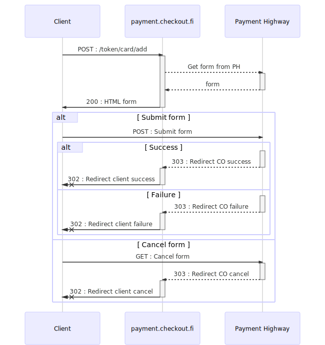

# Introduction

The following document describes the Checkout Finlands general public API in the context of payment buttons and making payments through the API.

Also included are APIs used for polling the status of a payment and to fetch contents of settlement reports.

To get started with the API, get in touch with Checkout Finland's customer support and you will be directed into the right direction from there. API is available for use for our merchants and partners.

# Testing

> Example class implementation that will be used in the later examples

```php
<?php

class Checkout
{
	private $version = "0001";
	private $language = "FI";
	private $country = "FIN";
	private $currency = "EUR";
	private $device	= "1";
	private $content = "1";
	private $type = "0";
	private $algorithm = "3";
	private $merchant = "";
	private $password = "";
	private $stamp = 0;
	private $amount	= 0;
	private $reference = "";
	private $message = "";
	private $return	= "";
	private $cancel	= "";
	private $reject	= "";
	private $delayed = "";
	private $delivery_date = "";
	private $firstname = "";
	private $familyname	= "";
	private $address = "";
	private $postcode = "";
	private $postoffice	= "";
	private $status	= "";
	private $email = "";

	public function __construct($merchant, $password)
	{
		$this->merchant	= $merchant; // merchant id
		$this->password	= $password; // security key (about 80 chars)
	}

	/*
 	 * generates MAC and prepares values for creating payment
	 */
	public function getCheckoutObject($data)
	{
		// overwrite default values
		foreach ($data as $key => $value) {
			$this->{$key} = $value;
		}

		$mac = strtoupper(md5("{$this->version}+{$this->stamp}+{$this->amount}+{$this->reference}+{$this->message}+{$this->language}+{$this->merchant}+{$this->return}+{$this->cancel}+{$this->reject}+{$this->delayed}+{$this->country}+{$this->currency}+{$this->device}+{$this->content}+{$this->type}+{$this->algorithm}+{$this->delivery_date}+{$this->firstname}+{$this->familyname}+{$this->address}+{$this->postcode}+{$this->postoffice}+{$this->password}"));
		$post['VERSION'] = $this->version;
		$post['STAMP'] = $this->stamp;
		$post['AMOUNT']	= $this->amount;
		$post['REFERENCE'] = $this->reference;
		$post['MESSAGE'] = $this->message;
		$post['LANGUAGE'] = $this->language;
		$post['MERCHANT'] = $this->merchant;
		$post['RETURN']	= $this->return;
		$post['CANCEL']	= $this->cancel;
		$post['REJECT']	= $this->reject;
		$post['DELAYED'] = $this->delayed;
		$post['COUNTRY'] = $this->country;
		$post['CURRENCY'] = $this->currency;
		$post['DEVICE']	= $this->device;
		$post['CONTENT'] = $this->content;
		$post['TYPE'] = $this->type;
		$post['ALGORITHM'] = $this->algorithm;
		$post['DELIVERY_DATE'] = $this->delivery_date;
		$post['FIRSTNAME'] = $this->firstname;
		$post['FAMILYNAME'] = $this->familyname;
		$post['ADDRESS'] = $this->address;
		$post['POSTCODE'] = $this->postcode;
		$post['POSTOFFICE'] = $this->postoffice;
		$post['MAC'] = $mac;

		$post['EMAIL'] = $this->email;
		$post['PHONE'] = $this->phone;

		return $post;
	}

	/*
	 * returns payment information in XML
	 */
	public function getCheckoutXML($data)
	{
	{
		$this->device = "10";
		return $this->sendPost($this->getCheckoutObject($data));
	}

	private function sendPost($post)
	{
		$options = array(
				CURLOPT_POST => 1,
				CURLOPT_HEADER => 0,
				CURLOPT_URL => 'https://payment.checkout.fi',
				CURLOPT_FRESH_CONNECT => 1,
				CURLOPT_RETURNTRANSFER => 1,
				CURLOPT_FORBID_REUSE => 1,
				CURLOPT_TIMEOUT => 20,
				CURLOPT_POSTFIELDS => http_build_query($post)
		);

		$ch = curl_init();
		curl_setopt_array($ch, $options);
		$result = curl_exec($ch);
	    curl_close($ch);

	    return $result;
	}

	public function validateCheckout($data)
	{
		$generatedMac = strtoupper(hash_hmac("sha256", "{$data['VERSION']}&{$data['STAMP']}&{$data['REFERENCE']}&{$data['PAYMENT']}&{$data['STATUS']}&{$data['ALGORITHM']}", $this->password));
		return ($data['MAC'] === $generatedMac);
	}

	public function isPaid($status)
	{
        return (in_array($status, array(2, 4, 5, 6, 7, 8, 9, 10)));
	}
}  // class Checkout
```

Test credentials

* Merchant Id (MERCHANT): `375917`
* Secret Key: `SAIPPUAKAUPPIAS`

Please note that not all payment methods support testing. The payment methods are enabled that support testing payments. There might be some features that are not working as they are intended to work in the testing side due to limitations to external integrations.

The whole test code is available at: [http://demo1.checkout.fi/xml2.txt](http://demo1.checkout.fi/xml2.txt).

# General flow

## Examples

### Payment process

The following illustrates how the user moves in the payment process.


1. Buyer goes into Checkout.fi
2. Chooses payment method
3. Paid for the purchase
4. Returns automatically to the merchant with the information of successful payment
5. If for some reason the buyer did not return to the merchant, Checkout queries the payment method provider for the information of the payment
6. Receive information from the payment method provider that the payment went through correctly
7. Inform merchant of the successful payment.
8. Merchant queries the payment status from Checkout
9. Checkout replies with the status

# Tokenization API

## Add and tokenize a new card

API for adding and tokenizing credit cards. Cards are automatically tokenized and migrated - the provider-token is 
migrated with checkout's tokens and the checkout token is responded. API uses redirections to handle information and 
moving between services. Requests are secured using hmac calculation using shared secret between message sender and
receiver.

The card adding flow has two phases :

1 - Request for the form

* On succeeded request the form is shown otherwise redirected to failure URL (or error shown see more below)

2 - Submit OR Cancel the form

* On succeeded request token is created and redirected to success URL with parameters (containg the token)
* On failure/error cases redirected to failure URL
* On cancelling the form redirected to cancel URL

### Simplified flow of adding a card

See detailed flow [here](images/add_card_flow_full.svg).



### API endpoint

* `POST`: https://payment.checkout.fi/token/card/add

###Test merchant and secret :

* merchant id : 375917
* merchant secret : SAIPPUAKAUPPIAS

### Request parameters

>Sample request to initiate card add form

```HTTP
POST /token/card/add HTTP/1.1
Host: payment.checkout.fi
Connection: keep-alive
Content-Length: 317
Pragma: no-cache
Cache-Control: no-cache
Content-Type: application/x-www-form-urlencoded
DNT: 1

merchant=375917&failure_url=https%3A%2F%2Fdemo.checkout.fi%2Faddcard%2Ffail&cancel_url=https%3A%2F%2Fdemo.checkout.fi%2Faddcard%2Fcancel&success_url=https%3A%2F%2Fdemo.checkout.fi%2Faddcard%2Fsuccess&request_id=a1ea51cd-24d0-4ac5-a035-0644d971ca57&hmac=5c998d76d1ddb9f5ed3375d5ba49ec90b46f52a6177c4a8b1bbb93348a9ad1b1
```

Initial POST request is made to API endpoint with following parameters (all parameters are mandatory) :

Field       | Type  | Description 
------------|-------|-------------
merchant    | AN    | merchant id 
success_url | AN    | Redirection URL on succeeded action
failure_url | AN    | Redirection URL on failure
cancel_url  | AN    | Redirection URL on user cancel
request_id  | UUID4 | Unique identificator for the request
hmac        | AN    | Hash calculated from message parameters 

### Sample parameters : 

Parameters on the example query:

* merchant : 375917
* failure_url : https://demo.checkout.fi/addcard/fail
* cancel_url : https://demo.checkout.fi/addcard/cancel
* success_url : https://demo.checkout.fi/addcard/success
* request_id : a1ea51cd-24d0-4ac5-a035-0644d971ca57
* hmac : 5c998d76d1ddb9f5ed3375d5ba49ec90b46f52a6177c4a8b1bbb93348a9ad1b1

### HMAC calculation

> Parameter string ready for SHA256 hmac calculation 

```text
var macString = 'cancel_url:https://demo.checkout.fi/addcard/cancel
failure_url:https://demo.checkout.fi/addcard/fail
merchant:375917
request_id:25d52044-31d5-48f3-b605-307671d668cd
success_url:https://demo.checkout.fi/addcard/success';

var hmac = HmacSHA256(macString, 'SAIPPUAKAUPPIAS');

// Correct SHA256 HMAC for string above is :
// 5c998d76d1ddb9f5ed3375d5ba49ec90b46f52a6177c4a8b1bbb93348a9ad1b1
```

Colon separated and alpabetically ordered name/value pairs are concatenated with 'new line' char (\n) and 
SHA265 HMAC is calculated with merchants secret. 

### Responses

On successfull add card request the HTML-document containing the form is returned.

On errors and failures the page is redirected to given failure URL with parameters. Parameters give more detailed
information on the failure.

Note: on some rare cases HTML output is shown instead. E.g. missing one of the required parameters (failure url for example)

### Response parameters

name          | type  | description 
--------------|-------|------------
co_code       | INT   | reaponse status (see detailed codes on below)
co_request_id | UUID4 | unified request identifier
co_status     | AN    | response status text (see detailed codes on below)
co_token      | UUID4 | Checkout token
hmac          | AN    | Hash calculated from co_ parameters

### Status codes on redirect URL's

co_code | co_status | description
--------|-----------|-----------------------------------
      0 |        ok | Token got, created and migrated ok
    100 |      fail | Missing mandatory parameters
    102 |      fail | HMAC validation failed (check merchant id)
    103 |      fail | HMAC validation failed
    104 |      fail | Failed creating form + detailed information
    105 |      fail | Failed creating a form
    150 |      fail | Missing mandatory parameters
    151 |      fail | Invalid request-id
    152 |      fail | Invalid request-id
    153 |      fail | Provider token already exists, tried to create duplicate
    154 |      fail | Callback failed + detailed information
    

## Token migration

Will convert an external token (for example Solinor token) to a Checkout-token, which can then be used for making payments in Checkout Finland Payment API.

If token has already been migrated earlier, statusCode '201' and Checkout-token will be returned.

```req
POST /token/migrate HTTP/1.1
Host: payment.checkout.fi
Content-Type: application/x-www-form-urlencoded
Cache-Control: no-cache

merchant=375917&provider_token=1296b3bc-407b-439b-9afd-c138e3ababa3
```

### HTTP Request

* `POST`: https://payment.checkout.fi/token/migrate

Body field     | Type  | Description                   | Notes
---------------|-------|-------------------------------|-------
provider_token | UUID4 | External (e.g. Solinor) token | 1
merchant       | N     | Merchant ID given by Checkout |

*Note 1.)* Must match ^[a-f0-9]{8}-[a-f0-9]{4}-4[a-f0-9]{3}-(8|9|a|b)[a-f0-9]{3}-[a-f0-9]{12}$

```xml
<?xml version="1.0" encoding="utf-8"?>
<response>
    <statusCode>200</statusCode>
    <statusText>Token was migrated successfully</statusText>
    <token>4c9705fd-c31d-4d2f-accf-f07b63eb80fe</token>
</response>
```

### HTTP Response (HTTP 200)

Body field | Type | Description
-------------- | -------------- | --------------
token | UUID4 | Checkout-token
statusCode | SCODE | Checkout status code, described in table below
statusText | AN | status message, e.g. 'Token has already been migrated...'

#### Status codes & -texts

Status Code | Status Text
---- | -----------
200 | Token was migrated successfully
201 | Token has already been migrated, will return existing checkout-token
400 | Merchant with given ID not found.
500 | General internal server error


# Payment API

## Payment

### URL

* `POST`: https://payment.checkout.fi

### Field descriptions

> Example uses the earlier created class (in testing stage)

```php
// Order information
$coData	= array();
$coData["stamp"] = time(); // unique timestamp
$coData["reference"] = "12344";
$coData["message"] = "Furniture materials\nSome wood, dust and magic fairies";
$coData["return"] = "http://demo1.checkout.fi/xml2.php?test=1";
$coData["delayed"] = "http://demo1.checkout.fi/xml2.php?test=2";
$coData["amount"] = "1000"; // price in cents
$coData["delivery_date"] = date("Ymd");
$coData["firstname"] = "Matti";
$coData["familyname"] = "Meikäläinen";
$coData["address"] = "Ääkköstie 5b3\nKulmaravintolan yläkerta";
$coData["postcode"] = "33100";
$coData["postoffice"] = "Tampere";
$coData["email"] = "support@checkout.fi";
$coData["phone"] = "0800 552 010";

// coObject for old method
$coObject = $co->getCheckoutObject($coData);
// change stamp for xml method so that the new call has unique stamp compared to the previous
$coData['stamp'] = time() + 1;
$response =	$co->getCheckoutXML($coData); // get payment button data
$xml = simplexml_load_string($response);
```

| #  | Description | Name | Value | Format | Required |
|----|-------------|------|-------|--------|----------|
| 1 | Payment version. Always "0001". | VERSION | "0001" | AN 4 | Yes |
| 2 | Unique identifier for the payment in the context of the merchant. Has to be unique. | STAMP | unique_id | AN 20 | Yes |
| 3 | Payment amount in cents. | AMOUNT | 0 | N 8 | Yes |
| 4 | Payment reference number for the payment from the merchant. | REFERENCE | standard_reference | AN 20 | Yes |
| 5 | Payment message from the Merchant to the buyer | MESSAGE | "Hi, thanks for shopping." | AN 1000 | No |
| 6 | Payment language. Options currently are: "FI", "EN", "SE". | LANGUAGE | "FI" | AN 2 | No |
| 7 | Merchant Id. Given identifier for the merchant (you get this from Checkout Finland), for testing: 375917 | MERCHANT | 375917 | AN 20 | Yes |
| 8 | Return callback. Called when the payment is successfully paid. | RETURN | | AN 300 | Yes |
| 9 | Cancel callback. Called when the payment is cancelled for some reason. | CANCEL | | AN 300 | Yes |
| 10 | Reject callback. Called when the payment is rejected. If not defined, on reject the cancel will be called. | REJECT | | AN 300 | No |
| 11 | Delayed callback. Called if the payment is delayed. | DELAYED | | AN 300 | No |
| 12 | Country, ISO-3166-1 alpha-3. | COUNTRY | "FIN" | AN 3 | No |
| 13 | Valuutta. Currently always EUR. | CURRENCY | "EUR" | AN 3 | Yes |
| 14 | Device type. `1 = HTML`, `10 = XML`. | DEVICE | 1 | N 2 | Yes |
| 15 | Content of the purchase. `1 = Normal`, `2 = adult industry` | CONTENT | 1 | N 2 | Yes |
| 16 | Payment types. | TYPE | 0 | N 1 | Yes |
| 17 | Checksum calculation algorithm. Use 3 commonly. | ALGORITHM | 3 | N 1 | Yes |
| 18 | Delivery date. Format: YYYYMMDD.  | DELIVERY_DATE | 20171231 | N 8 | Yes |
| 19 | Required when using loaning services. First name of the buyer. | FIRSTNAME | "Matti" | AN 40 | No |
| 20 | Required when using loaning services. Last name of the buyer. | FAMILYNAME | "Meikäläinen" | AN 40 | No |
| 21 | Required when using loaning services. Delivery address. | ADDRESS | "Maantie 123" | AN 40 | No |
| 22 | Required when using loaning services. Delivery post number. | POSTCODE | "12345" | AN 14 | No |
| 23 | Required when using loaning services. Delivery postal office. | POSTOFFICE | "" | AN 18 | No |
| 24 | Checksum is calculated by combining fields 1-23 and the secret key, separating them with a `+`-sign  | MAC |  | AN 32 | Yes |
| 25 | Buyer email. | EMAIL | | AN 200 | No |
| 26 | Buyer phone number. | PHONE | | AN 30 | No |

*Field 14*: If you want to use Checkouts payment wall, use HTML device type (end point). If the payment buttons are getting integrated as part of merchants online service, use XML. Checkout recommends using XML as it allows more tight integration and customization. HTTP POST is done by the integrating service and Checkout replies with XML payment wall that the service then can open and manipulate to render the payment wall.

*Field 17*: `3 == sha256 and md5`. Payment is created with MD5 and the return checksum is calculated with SHA256.

*Field 18*: Best estimate of the delivery date of the product. If no date is known, use the latest possible date. Products that require loan are sent to the buyer by the delivery date.

### Calculating the checksum

When calculating the checksum use the fields 1 to 23 and the security key as the last field. The fields are separated from each other with `+` -sign. If a field is empty, use empty string in the calculation. The calculated checksum needs to be transferred in capitalized characters. Check is done with the method defined in field 17.

> Example of calculating the MD5

```php
MD5(
  VERSION+STAMP+AMOUNT+REFERENCE+MESSAGE+
  LANGUAGE+MERCHANT+RETURN+CANCEL+REJECT+
  DELAYED+COUNTRY+CURRENCY+DEVICE+CONTENT+
  TYPE+ALGORITHM+DELIVERY_DATE+FIRSTNAME+
  FAMILYNAME+ADDRESS+POSTCODE+POSTOFFICE+SECRET_KEY
)
```

### Response

The response will arrive with the users browser, if the user returns to the service. If the for some reason this does not happen, Checkout will send a HTTP GET -request to the same address the browser was supposed to be redirected to, the service has to accept the incoming HTTP GET from Checkout even though it might lack cookies or a session. The message will be checked with MAC -check.

Additional information on how to do the check can be found from the example file:  [http://demo1.checkout.fi/xml2.txt](http://demo1.checkout.fi/xml2.txt).

| # | Description | Field | Value |
|---|-------------|-------|-------|
| 1 | Payment version. Always "0001". | VERSION | "0001" |
| 2 | Unique identifier for the payment in the context of the merchant. Has to be unique. | STAMP | unique_id |
| 3 | Payment reference number for the payment from the merchant. | REFERENCE | standard_reference |
| 4 | Payment archive id | PAYMENT | Checkouts unique ID for the payment. |
| 5 | Payment status | STATUS | 2 = success | 
| 6 | Used algorithm. Use 3. | ALGORTH | 3 |
| 7 | MAC check | MAC |

Responses checksum is calculated using HMAC SHA256 the following way:

`HASH_HMAC_SHA256(SECURITY_KEY, "VERSION&STAMP&REFERENCE&PAYMENT&STATUS&ALGORITHM")`

Field separator is the `&`-sign.

> Example of implementing the check from the demo1.checkout.fi/xml2.txt

```php
$generatedMac=strtoupper(hash_hmac("sha256","{$data['VERSION']}&{$data['STAMP']}&{$data['REFERENCE']}&{$data['PAYMENT']}&{$data['STATUS']}&{$data['ALGORITHM']}",$this->password));
```


### Payment Statuses

| Status | Description |
|---------------|-------------|
| -10 | Payment refunded to the buyer |
| -4 | Payment cannot be found |
| -3 | Payment timeout |
| -2 | Payment cancelled by Checkout or payment method provider |
| -1 | Payment cancelled by buyer |
| 1 | Payment pending |
| 2 | Payment approved |
| 3 | Payment delayed |
| 4 | This status is saved for future additions. Works like status 3. |
| 5 | This status is saved for future additions. Approved payment. |
| 6 | Payment frozen |
| 7 | Payment method provider has accepted payment and it required approval |
| 8 | Payment method provider has accepted payment and it has been approved |
| 9 | This status is saved for future additions.|
| 10 | Payment settled |

* Payment has been charged or is approved when the payment is in statuses: 2, 4, 5, 6, 7, 8, 9, 10.
* Retailer or a merchant can approve the order when the status is 2, 5, 6, 7, 8, 9 or 10.

## Shop-in-shop payment

Payments for shop-in-shop customers. Includes "aggregate merchant" (master merchant) and items with submerchants.
Making SiS-payments with single items/submerchants is ok.

If credit card token is sent to PaymentAPI, the API will use tokenized card for payment. If no token is sent, the user will be guided to credit card information input (payment).

Commit can be used with token-payments. If commit is true, the tokenized credit card will be charged. If commit is false, it will make a payment reservation (authorization hold) on the card. This authorization hold will be committed or retracted later through the 'commit payment' or 'retract payment' API's.

Actual HTTP request is made using two name/value pairs containing

>HTTP-request

```req
POST / HTTP/1.1
Host: payment.checkout.fi
Content-Type: application/x-www-form-urlencoded
Cache-Control: no-cache

CHECKOUT_XML=<base64 encoded xml string>&CHECKOUT_MAC=<string>
```

### HTTP Request

* `POST`: https://payment.checkout.fi


| Name | Description |
|------|-------------|
| CHECKOUT_MAC | MD5 hash calculated from sent values |
| CHECKOUT_XML | Base64 encoded representation of the XML string. XML explained below |

Calculating MD5 hash for CHECKOUT_MAC field:

strtoupper(md5(&lt;xml_string&gt; + '+' + &lt;aggregator_merchant_secret&gt;))

! Note the plus sign between strings is part of a string not concatenating operator etc.

>Create SiS payment XML format

```xml
<?xml version="1.0"?>
<checkout xmlns="http://checkout.fi/request">
  <request type="aggregator" test="false">
      <aggregator></aggregator>
      <version></version>
      <stamp></stamp>
      <reference></reference>
      <description></description>
      <device></device>
      <content></content>
      <type></type>
      <algorithm></algorithm>
      <currency></currency>
      <token></token>
      <commit></commit>
      <items>
          <item>
              <code></code>
              <stamp></stamp>
              <description></description>
              <price currency="EUR" vat="23"></price>
              <merchant></merchant>
              <control></control>
              <reference></reference>
          </item>
          <amount currency="EUR"></amount>
      </items>
      <buyer>
          <company vatid=""></company>
          <firstname></firstname>
          <familyname></familyname>
          <address><![CDATA[ ]]></address>
          <postalcode></postalcode>
          <postaloffice></postaloffice>
          <country></country>
          <email></email>
          <gsm></gsm>
          <language></language>
      </buyer>
      <delivery>
          <date></date>
          <company vatid=""></company>
          <firstname></firstname>
          <familyname></familyname>
          <address><![CDATA[ ]]></address>
          <postalcode></postalcode>
          <postaloffice></postaloffice>
          <country></country>
          <email></email>
          <gsm></gsm>
          <language></language>
      </delivery>
      <control type="default">
          <return></return>
          <reject></reject>
          <cancel></cancel>
      </control>
  </request>
</checkout>
```


### XML data

| Name        | Description  | Value | Format | Required | Notes |
|-------------|------|-------|--------|----------|-------|
| AGGREGATOR  | Merchant Id of aggregate merchant. Given identifier for the merchant (you get this from Checkout Finland), for testing: 375917 | 375917 | AN 20 | &cross; | |
| VERSION     | Payment version.<br />`Always "0002"` |  "0002" | AN 4 | &cross; | |
| STAMP       | Unique identifier for the payment in the context of the merchant. Has to be unique. | unique_id | AN 20 | &cross; | |
| REFERENCE   | Payment reference number for the payment from the merchant. |  standard_reference | AN 20 | &cross; | |
| DESCRIPTION | Description of payment/purchase |  "Item 1#, Item #2..." | AN 1000 |  | |
| DEVICE      | Device type<br />`1 = HTML`, `10 = XML` |  1 | N 2 | &cross; | |
| CONTENT     | Content of the purchase.<br />`1 = Normal`, `2 = adult industry` |  1 | N 2 | (&cross;) | 1 |
| TYPE        | Payment types. See payment types below. |  0 | N 1 | (&cross;) | 1 |
| ALGORITHM   | Checksum calculation algorithm. Use 3 commonly. |  3 | N 1 | &cross; | |
| CURRENCY    | Currency. Currently always EUR. | "EUR" | AN 3 | &cross; | |
| TOKEN       | Token of credit card used on tokenized payments | "f47ac10b-58cc-4372-a567-0e02b2c3d479" | UUID4 | (&cross;) |  2, 4 |
| COMMIT      | Commit token payment (if false, makes a reservation). Field is ignored if not tokenized payment. Default value is TRUE. | true/false | BOOL | (&cross;) |  2 |
| ITEMS       | `Items` XML element | XML | XML | &cross;  | |
| BUYER       | `Buyer` XML element | XML | XML | &cross;  | |
| DELIVERY    | `Delivery` XML element | XML | XML | &cross;  | |
| CONTROL     | `Control` XML element | XML | XML | &cross;  | |
| REFERENCE   | Item level `Reference`. Used when refunding payments, must be unique if used. | ABCDE1234 | AN | (&cross;)  | |


<!--
Are these relevat to this API???
| Delayed callback. Called if the payment is delayed. | DELAYED | | AN 300 | | |
| Checksum is calculated by combining fields 1-23 and the secret key, separating them with a `+`-sign  | MAC |  | AN 32 | &cross; | 2 |
-->

*Note 1.)* Required only with non-token -payments.

*Note 2.)* Required only on tokenized payments

*Note 3.)* For calculating checksum, check above on Payment-API.

*Note 4.)* Must match ^[a-f0-9]{8}-[a-f0-9]{4}-4[a-f0-9]{3}-(8|9|a|b)[a-f0-9]{3}-[a-f0-9]{12}$

### XML-element : Items

| Name   | Description  | Value | Format | Required | Notes |
|--------|------|-------|--------|----------|-------|
| ITEM   | 1 to n `Item` XML elements | XML | XML | &cross;  | |
| AMOUNT | Amount in cents. Has to be exact total from sum of the items prices | 1000 | N | &cross; | |

### XML-element : Item

| Name        | Description  | Value | Format | Required | Notes |
|-------------|------|-------|--------|----------|-------|
| DESCRIPTION | Description of payment/purchase | "Product #1" | AN | &cross; | |
| PRICE       | Price of item in cents |  50 | N | &cross; | |
| MERCHANT    | Merchant id of the shop selling the item (SiS-shop) |  585858 | N | &cross; | |
| CONTROL     | Holds a list of JSON objects that define the commission which SiS-merchant will receive. Not required if no commission given to SiS-merchant |  | JSON | (&cross;) | 1 |
| CODE        | Product id/sku/code |  | AN |  | |

*Note 1.)* Required if commissions are to be deducted

### JSON object in Item.control field

>JSON data in ITEMS.ITEM.CONTROL field

```JSON
[
    {
    a : <amountm in euro cents>,
    m : <merchant id>,
    d : <description>
    }
]
```

| Name| Description  | Value | Format | Required | Notes |
|-------------|------|-------|--------|----------|-------|
|   a | Amount of commission in cents | 48 | N | | |
|   m | Merchant ID, that will receive the commission from the payment (usually same as ITEM.MERCHANT) | 585858 | N | | |
|   d | Message/description of payment | "commission for item #1" | AN | | |

### Payment types

 Type| Description          | Notes
-----|----------------------|-------
   0 | Normal payment       |
   9 | Shop in shop payment |

### XML-element : Buyer

| Name       | Description | Value | Format | Required | Notes |
|------------|------|-------|--------|----------|-------|
| FIRSTNAME  | Required when using loaning services. First name of the buyer. |  "Matti" | AN 40 |  | |
| FAMILYNAME | Required when using loaning services. Last name of the buyer. |  "Meikäläinen" | AN 40 |  | |
| ADDRESS    | Required when using loaning services. Delivery address. |  "Maantie 123" | AN 40 |  | |
| POSTCODE   | Required when using loaning services. Delivery post number. | "12345" | AN 14 |  | |
| POSTOFFICE | Required when using loaning services. Delivery postal office. |  "" | AN 18 |  | |
| COUNTRY    | Country, ISO-3166-1 alpha-3. | "FIN" | AN 3 | No | |
| EMAIL      | Buyer email |  | AN 200 | No | |
| PHONE      | Buyer phone number |  | AN 30 | No | |
| LANGUAGE   | Payment language. Options currently are: "FI", "EN", "SE". | "FI" | AN 2 |  | |

### XML-element : Delivery

| Name        | Description  | Value | Format | Required | Notes |
|-------------|------|-------|--------|----------|-------|
| DATE        | Delivery date. Format: YYYYMMDD.  |  20171231 | N 8 | &cross; | |
| FIRSTNAME   | Required when using loaning services. First name of the buyer. |  "Matti" | AN 40 |  | |
| FAMILYNAME  | Required when using loaning services. Last name of the buyer. |  "Meikäläinen" | AN 40 |  | |
| ADDRESS     | Required when using loaning services. Delivery address. |  "Maantie 123" | AN 40 |  | |
| POSTCODE    | Required when using loaning services. Delivery post number. | "12345" | AN 14 |  | |
| POSTOFFICE  | Required when using loaning services. Delivery postal office. |  "" | AN 18 |  | |
| COUNTRY     | Country, ISO-3166-1 alpha-3. | "FIN" | AN 3 | No | |
| EMAIL       | Buyer email |  | AN 200 | No | |
| PHONE       | Buyer phone number |  | AN 30 | No | |
| LANGUAGE    | Payment language. Options currently are: "FI", "EN", "SE". | "FI" | AN 2 |  | |   

### XML-element : Control

Name   | Description  | Value | Format | Required | Notes
-------|------|-------|--------|----------|-------
RETURN | Return callback. Called when the payment is successfully paid. |  | AN 300 | &cross; * | 1
CANCEL | Cancel callback. Called when the payment is cancelled for some reason. |  | AN 300 | &cross; * | 1
REJECT | Reject callback. Called when the payment is rejected. If not defined, on reject the cancel will be called. |  | AN 300 |  |

>Response XML

```xml
<?xml version="1.0" encoding="utf-8"?>
<response>
    <statusCode></statusCode>
    <statusText></statusText>
</response>
```

### Response body (XML)

 Name      | Description | Format
-----------|-------------|-------
statusCode | HTTP Status code (200 if payment/reservation successful) | N
statusText | Status text (e.g. 'payment done') |  AN


### Response status codes

Code | Description
-----|-------------
 200 | OK, payment committed
 201 | OK, authorization hold created
 400 | Aggregator not found
 401 | Merchant has no aggregator status
 402 | Invalid merchant id
 403 | Merchant not found
 404 | Amounts wont match
 405 | Trade amount is 0 or less
 406 | Token not found
 500 | Error parsing XML
 502 | Creating a trade failed (&lt;errcode&gt;)
 503 | Failed creating new trade
 504 | Aggregate can't buy from self
 505 | Failed to get payment archive ID : &lt;detailed information&gt;
 506 | Authorization failed or unable to create a debit transaction
 507 | Failed : &lt;detailed information&gt;

## Retract authorization hold

Retracts (deletes) an existing authorization hold.

### HTTP Request

```
POST /token/payment/retract HTTP/1.1
Host: payment.checkout.fi
Content-Type: application/x-www-form-urlencoded
Cache-Control: no-cache

stamp=1492599660&hmac=3BB1330F9A90BBEBDB586EA58CDE70F2A1DB8870E5A71DF868384F14916377D2&merchant=375917
```

`POST https://payment.checkout.fi/token/payment/retract`

Body field     | Type  | Description                   | Notes |
---------------|-------|-------------------------------|-------|
merchant       | N     | Merchant id of which the initial reservation was done with |
stamp          | AN 20 | Stamp id of the initial token payment |
hmac           | AN    | Calculated HMAC, [instructions](#hmac-calculation) |


### HTTP Response

```
<?xml version="1.0" encoding="utf-8"?>
<response>
    <statusCode>200</statusCode>
    <statusText>Authorization hold retracted.</statusText>
</response>
```


Body field | Type | Description
---------- | ---- | -----------
statusCode | SCODE | Checkout status code, described in table below
statusText | AN | Status message

#### Status codes & -texts

Status Code | Status Text
---- | -----------
200 | Authorization hold retracted.
400 | Merchant with given ID not found.
401 | No trade with given merchant/stamp found.
402 | Payment has been committed.
403 | Authorization hold has already been reverted.
500 | No transactions found.
501 | Error fetching trade status.
502 | Error while fetching transaction ID.
503 | Error parsing response.
504 | Error while fetching result.
505 | Error while reverting.
600 | Missing required parameters.
700 | Invalid HMAC.

## Commit payment

Commits an existing credit card reservation.

### HTTP Request

```code
POST /token/payment/commit HTTP/1.1
Host: payment.checkout.fi
Content-Type: application/x-www-form-urlencoded
Cache-Control: no-cache

stamp=1492599660&hmac=104150D231401BDEB01F3E62B6FB32812C8314E3C0E9D10CB2749215FA0777D2&merchant=375917&amount=50
```

`POST https://payment.checkout.fi/token/payment/commit`

Body field     | Type  | Description                   | Notes |
---------------|-------|-------------------------------|-------|
merchant       | N     | Merchant id of which the initial reservation was done with |
stamp          | AN 20 | Stamp id of the initial token payment |
amount         | N     | Amount of payment reservation to be committed (cents) | 1
hmac           | AN    | Calculated HMAC, [instructions](#hmac-calculation) |

*Note 1.)* Must be less than or equal to initial authorization hold amount

### HTTP Response

```xml
<?xml version="1.0" encoding="utf-8"?>
<response>
    <statusCode>200</statusCode>
    <statusText>Payment committed.</statusText>
</response>
```

Body field | Type | Description
-------------- | -------------- | --------------
statusCode | SCODE | Checkout status code, described in table below
statusText | AN | Status message

### Status codes & -texts

Status Code | Status Text
---- | -----------
200 | Payment committed.
400 | Merchant with given ID not found.
401 | No trade with given merchant/stamp found.
402 | Payment has already been committed.
403 | Commit amount larger than authorization hold.
404 | Cancelled payment cannot be committed.
405 | Problem with commit : &lt;detailed information&gt;
406 | Negative commit amount not allowed.
500 | No transactions found.
501 | Error fetching trade status.
502 | Error while fetching transaction ID.
503 | Error parsing response.
504 | Error while fetching result.
505 | Error while committing.
506 | Error committing payment : &lt;detailed information&gt;
600 | Missing required parameters.
700 | Invalid HMAC.


## Fetch trade info

Fetches info & status of trade.

### HTTP Request

```
POST /token/payment/info HTTP/1.1
Host: payment.checkout.fi
Content-Type: application/x-www-form-urlencoded
Cache-Control: no-cache

stamp=1492599660&merchant=375917&hmac=3BB1330F9A90BBEBDB586EA58CDE70F2A1DB8870E5A71DF868384F14916377D2
```

`POST https://payment.checkout.fi/token/payment/info`

Body field     | Type  | Description                   | Notes |
---------------|-------|-------------------------------|-------|
merchant       | N     | Merchant id of which the initial reservation was done with |
stamp          | AN 20 | Stamp id of the initial token payment |
hmac           | AN    | Calculated HMAC, [instructions](#hmac-calculation) |


### HTTP Response

```
<?xml version="1.0" encoding="utf-8"?>
<response>
    <statusCode>200</statusCode>
    <statusText>Payment information fetched.</statusText>
    <payment>
        <status>reverted</status>
        <currentAmount>0</currentAmount>
        <initialAmount>100</initialAmount>
        <createdTime>2017-04-19T11:01:01Z</createdTime>
        <modifiedTime>2017-04-19T11:13:34Z</modifiedTime>
        <currency>EUR</currency>
    </payment>
</response>
```


Body field | Type | Description
-------------- | -------------- | --------------
statusCode | SCODE | Checkout status code, described in table below
statusText | AN | Status message
payment    || Object including info-fields|
payment.status | AN | Status of trade, e.g. 'committed', 'reverted'
payment.currentAmount | AMOUNT | Current amount of trade in cents (e.g. if committed with amount 50, then 50)
payment.initialAmount | AMOUNT | Initial amount of trade in cents (amount which trade was originally created with)
payment.createdTime | N | Timestamp of when trade was created
payment.modifiedTime | N | Timestamp when trade was last modified
payment.currency | CURRENCY | Currency with which trade was created, e.g. "EUR"

### Status codes & -texts

Status Code | Status Text
---- | -----------
200 | Payment information fetched.
400 | Merchant with given ID not found.
401 | No trade with given merchant/stamp found.
500 | No transactions found.
501 | Information fetching failed.
600 | Missing required parameters.
700 | Invalid HMAC.

## Refund

Creates a refund for succeeded charge or already committed authorization hold.

### HTTP request

* `POST`: https://rpcapi.checkout.fi/refund2

<!--
### HTTP Request

```
POST /token/payment/info HTTP/1.1
Host: payment.checkout.fi
Content-Type: application/x-www-form-urlencoded
Cache-Control: no-cache

stamp=1492599660&merchant=375917&hmac=3BB1330F9A90BBEBDB586EA58CDE70F2A1DB8870E5A71DF868384F14916377D2
```
-->

### Field descriptions

> Example of the sent XML that gets base64 encoded

```
<?xml version='1.0'?>
<checkout>
 <identification>
  <merchant>1234</merchant> <!-- merchant id -->
  <stamp>123456</stamp> <!-- message unique identifier -->
 </identification>
 <message>
  <refund>
   <stamp>12345</stamp> <!-- refund payment unique identifier  -->
   <reference>12345</reference> <!-- reference for the payment refund -->
   <amount>1245</amount> <!-- sum in cents -->
   <receiver>
     <email>email@osoi.te</email>
   </receiver>
  </refund>
 </message>
</checkout>
```

> Example of calculating the MD5

```php
$messageMac=strtoupper(hash_hmac("sha256", base64_encode($message), $secretKey));
```

Description | Field | Format | Required |
------------|-------|--------|----------|
Contains the base64 encoded XML. | data | AN | Yes |
Mac checksum of the data. | mac | AN | Yes |

### Response status codes and messages

code | message
-----|--------
2100 | REFUNDED
1200 | CHECKSUM MISMATCH
1201 | DATA FIELD IS MISSING
1202 | MAC FIELD IS MISSING
1203 | DATA NOT BASE64 ENCODED STRING
1204 | MAC FORMAT ERROR
2200 | TRADE NOT FOUND
2201 | TRADE ALREADY REFUNDED
2202 | REFUND AMOUNT TOO BIG
2203 | MERCHANT BALANCE TOO LOW
2204 | ACCOUNT NOT ACCEPTED
2205 | REFUND AMOUNT TOO LOW
2209 | AMOUNT NOT INTEGER
2220 | GENERIC ERROR
2221 | UNKNOWN ERROR

<!--12515 | COMPANY NOT FOUND-->

> Example response

```
<?xml version='1.0'?>
<checkout>
 <response>
  <stamp>12345</stamp>
  <statusMessage>REFUNDED</statusMessage>
  <statusCode>2100</statusCode>
  </response>
</checkout>";
```

# Polling API

## Polling

```
<?php

// this example code can be run in a terminal, but current payment values are not valid

$url 			= 'https://rpcapi.checkout.fi/poll';

$merchant_id 	= '375917';
$secret 		= 'SAIPPUAKAUPPIAS';

$stamp 			= '100'; // Stamp generated generated by webshop when creating the payment
$reference 		= '100'; // Refence number generated by webshop when creating the payment
$amount 		= '100'; // Amount in cents 1€ = 100

$formdata = [
	'VERSION'		=> '0001',	//Normal payment version is 0001, 0002 is used for shop-in-shop payments	'STAMP'			=> $stamp,
	'REFERENCE'		=> $reference,
	'MERCHANT'		=> $merchant_id,
	'AMOUNT'		=> $amount,
	'CURRENCY'		=> 'EUR',
	'FORMAT'		=> '1',
	'ALGORITHM'		=> '1'
];

$formdata['MAC'] = strtoupper(md5(implode('+', $formdata) . "+{$secret}"));


$options = array(
    CURLOPT_POST            => 1,
    CURLOPT_HEADER          => 0,
    CURLOPT_URL             => $url,
    CURLOPT_FRESH_CONNECT   => 1,
    CURLOPT_RETURNTRANSFER  => 1,
    CURLOPT_FORBID_REUSE    => 1,
    CURLOPT_TIMEOUT         => 4,
    CURLOPT_POSTFIELDS      => http_build_query($formdata)
);

$ch = curl_init();
curl_setopt_array($ch, $options);
$result = curl_exec($ch);

curl_close($ch);

echo "\n";

var_dump($result);

echo "\n";
echo strtoupper(md5(implode('+', $formdata) . "+{$secret}"));
echo "\n";
```

Responds with the current status of the payment, can be used to verify success or failure of a payment when

request URL: https://rpcapi.checkout.fi/poll

method = post


Field values

|Field|Name|Value|
|------|-----|-----|
|Version of API used|VERSION|001=standard payment 002=shop-in-shop payment|
|Unique stamp generated when payment was created|STAMP| value generated by web shop
|Web shops reference code generated when payment was created|REFERENCE|value generated by web shop
|Merchant ID|MERCHANT|merchant ID number assigned by Checkout Finland
|Payment total amount|AMOUNT|total amount in cents 1€=100
|Currency used|CURRENCY|EUR (only euros are currently supported)
|Format for response|FORMAT|1 (only one format is currently available)
|Algorithm|ALGORITHM|1 (always "1" meaning MD5 algorithm)
|Security hash|MAC|calculated using security key provided by Checkout Finland

## Poll MD5 hash calculation

MD5 checksum calculation takes into account the fields 1-8 and secret key (aka merchant secret). Fields are separated with +-sign and text must be uppercase.

***MD5(VERSION+STAMP+REFERENCE+MERCHANT+AMOUNT+CURRENCY+
FORMAT+ALGORITHM+security key)***

## Poll response

A successful poll request will receive a XML file response.

```
//Example response

<?xml version=”1.0”?>

<trade>
	<status>2</status> //in this example payment has been succesful but not yet paid out by Checkout Finland
</trade>
```

If the security hash or checksum of field values does not match Checkout Finlands database the API will respond with "Error".

# Data types

Type | Format | Example
-------------- | -------------- | --------------
N | ^[0-9]+$ | 505050
AN | ^[.,’-=/\w;\s]{0,1023}$ | Alph4num3r1c
BOOL | true/false | true
AMOUNT | ^\d{1,12}$ | 9000
CURRENCY | ^(EUR)$ | EUR
UUID4 | ^[a-f0-9]{8}-[a-f0-9]{4}-[a-f0-9]{4}-[a-f0-9]{4}-[a-f0-9]{12}$ | f47ac10b-58cc-4372-a567-0e02b2c3d479
SCODE | ^\d{1,6}$ | 9001
TIMESTAMP | \d{4}-[0-1]\d-[0-3]\dT[0-2]\d:[0-5]\d:[0-5]\d\+\d{4} | 2017-04-19T11:01:01Z
JSON | | [{a:1,b:2},{data:'some text'}]
XML | | &lt;data&gt;Some data&lt;/data&gt;

# HMAC-calculation

If an API (e.g. [commit](#commit-payment), [retract](#retract-authorization-hold), [trade info fetch](#fetch-trade-info)) requires the 'hmac'-field, you must calculate it with SHA256 using the other request fields in alphabetized order + your own merchant-specific secret which is given to you by Checkout.

```javascript
/*
 * Calculates SHA256 HMAC with given request parameters (which will be alphabetized for calculation)
 * and given secret string.
 *
 * The calculation string will be formed by combining key and value separated by ':'
 * and each key-value pair separated by newline.
 *
 * @param {[]} reqParams Array of request parameters.
 * @param {string} secret Merchant specific secret string.
 * @return {string} Calculated SHA256 HMAC string.
 */
function calculateHMAC(reqParams, secret) {
    var toHMAC = function(key) {
        return key + ':' + reqParams[key];
    }

    // separate the keys into a alphabetized array, leave out 'hmac'-field
    var sortedKeys = Object.keys(reqParams).filter(function(key) { return key !== 'hmac'; }).sort();

    var macString = sortedKeys.map(function(k) { return toHMAC(k); }).join('\n');

    return Packages.fi.checkout.tools.HMac.sha256(macString, secret);
}
```

```
// Node.js example:
node -e "console.log(require('crypto').createHmac('sha256', 'merchantSecret').update('amount:50\nmerchant:375917\nstamp:1493200949').digest('hex'));"
```

Separate the key & value of the request parameters with ':' and separate each parameter with a linebreak '\n'.

```
# if the request fields are for example 'merchant', 'stamp' & 'amount, the final mac string used for calculation would be this:
"amount:50\nmerchant:375917\nstamp:1492599660"

The secret key used will be merchant-specific.
```

Leave the hmac-parameter itself out of the calculation.

# Example data and requests

## Payment API, usage example in PHP

* https://payment.checkout.fi

>Sample 'payment.xml' file

```xml
<?xml version="1.0"?>
    <checkout xmlns="http://checkout.fi/request">
        <request type="aggregator" test="false">
            <aggregator>375917</aggregator>
            <token>02343287-1e1a-4b92-8008-367e6ce35221</token>
            <version>0002</version>
            <stamp>123456789</stamp>
            <reference>123456</reference>
            <device>10</device>
            <content>1</content>
            <type>0</type>
            <algorithm>3</algorithm>
            <currency>EUR</currency>
            <commit>false</commit>
            <description>SiS tokenized payment test request</description>
            <items>
                <item>
                    <code/>
                    <description>sub trade</description>
                    <price currency="EUR" vat="23">2500</price>
                    <merchant>391830</merchant>
                    <control/>
                </item>
                <amount currency="EUR">2500</amount>
            </items>
            <buyer>
                <country>FIN</country>
                <language>FI</language>
            </buyer>
            <delivery>
                <date>20170619</date>
            </delivery>
        </request>
    </checkout>
```
>PHP used to generate valid query from XML file (above)

```php
<?php
$aggregatorMerchantSecret = "SAIPPUAKAUPPIAS";

$xml = simplexml_load_file("payment.xml");
$checkoutXML = base64_encode($xml->asXML());
$checkoutMac = strtoupper(md5("{$checkoutXML}+{$aggregatorMerchantSecret}"));

$streamContext = stream_context_create(array(
  'http' => array(
    'method' => 'POST',
    'header' => 'Content-Type: application/x-www-form-urlencoded',
    'content' => http_build_query(array(
        'CHECKOUT_XML' => $checkoutXML,
        'CHECKOUT_MAC' => $checkoutMac
      )
    )
  ),
  "ssl" => array(
      "verify_peer" => false,
      "verify_peer_name" => false,
  )
));

$response = file_get_contents('https://payment.checkout.fi/', false, $streamContext);
```
>Raw HTTP request sent to server

```plaintext
Host: payment.checkout.fi
Connection: close
Content-Length: 1567
Content-Type: application/x-www-form-urlencoded

CHECKOUT_XML=PD94bWwgdmVyc2lvbj0iMS4wIj8%2BCjxjaGVja291dCB4bWxucz0iaHR0cDovL2NoZWNrb3V0LmZpL3JlcXVlc3QiPgogICAgPHJlcXVlc3QgdHlwZT0iYWdncmVnYXRvciIgdGVzdD0iZmFsc2UiPgogICAgICAgIDxhZ2dyZWdhdG9yPjM3NTkxNzwvYWdncmVnYXRvcj4KICAgICAgICA8dG9rZW4%2BMDIzNDMyODctMWUxYS00YjkyLTgwMDgtMzY3ZTZjZTM1MjIxPC90b2tlbj4KICAgICAgICA8dmVyc2lvbj4wMDAyPC92ZXJzaW9uPgogICAgICAgIDxzdGFtcD4xMjM0NTY3ODk8L3N0YW1wPgogICAgICAgIDxyZWZlcmVuY2U%2BMTIzNDU2PC9yZWZlcmVuY2U%2BCiAgICAgICAgPGRldmljZT4xMDwvZGV2aWNlPgogICAgICAgIDxjb250ZW50PjE8L2NvbnRlbnQ%2BCiAgICAgICAgPHR5cGU%2BMDwvdHlwZT4KICAgICAgICA8YWxnb3JpdGhtPjM8L2FsZ29yaXRobT4KICAgICAgICA8Y3VycmVuY3k%2BRVVSPC9jdXJyZW5jeT4KICAgICAgICA8Y29tbWl0PmZhbHNlPC9jb21taXQ%2BCiAgICAgICAgPGRlc2NyaXB0aW9uPlNpUyB0b2tlbml6ZWQgcGF5bWVudCB0ZXN0IHJlcXVlc3Q8L2Rlc2NyaXB0aW9uPgogICAgICAgIDxpdGVtcz4KICAgICAgICAgICAgPGl0ZW0%2BCiAgICAgICAgICAgICAgICA8Y29kZS8%2BCiAgICAgICAgICAgICAgICA8ZGVzY3JpcHRpb24%2Bc3ViIHRyYWRlPC9kZXNjcmlwdGlvbj4KICAgICAgICAgICAgICAgIDxwcmljZSBjdXJyZW5jeT0iRVVSIiB2YXQ9IjIzIj4yNTAwPC9wcmljZT4KICAgICAgICAgICAgICAgIDxtZXJjaGFudD4zOTE4MzA8L21lcmNoYW50PgogICAgICAgICAgICAgICAgPGNvbnRyb2wvPgogICAgICAgICAgICA8L2l0ZW0%2BCiAgICAgICAgICAgIDxhbW91bnQgY3VycmVuY3k9IkVVUiI%2BMjUwMDwvYW1vdW50PgogICAgICAgIDwvaXRlbXM%2BCiAgICAgICAgPGJ1eWVyPgogICAgICAgICAgICA8Y291bnRyeT5GSU48L2NvdW50cnk%2BCiAgICAgICAgICAgIDxsYW5ndWFnZT5GSTwvbGFuZ3VhZ2U%2BCiAgICAgICAgPC9idXllcj4KICAgICAgICA8ZGVsaXZlcnk%2BCiAgICAgICAgICAgIDxkYXRlPjIwMTcwNjE5PC9kYXRlPgogICAgICAgIDwvZGVsaXZlcnk%2BCiAgICA8L3JlcXVlc3Q%2BCjwvY2hlY2tvdXQ%2BCg%3D%3D&CHECKOUT_MAC=ECC3A796D38A2050C31CD841A593488F
```
> Respose XML

```xml
<?xml version="1.0" encoding="utf-8"?>
<response>
 <statusCode>201</statusCode>
 <statusText>OK, authorization hold created</statusText>
</response>
```


### Tokenized SiS payment using minimum required fields

Creates an authorization hold for 25.00 euros.

# Payment Statuses

| Status | Description |
|---------------|-------------|
| -10 | Payment refunded to the buyer |
| -4 | Payment cannot be found |
| -3 | Unpaid payment older that 14 days |
| -2 | Payment cancelled by Checkout or payment method provider |
| -1 | Payment cancelled by buyer |
| 1 | Payment pending |
| 2 | Payment approved |
| 3 | Payment delayed, bank transfer payment method chosen by buyer |
| 4 | This status is saved for future additions. Works like status 3. |
| 5 | This status is saved for future additions. Approved payment. |
| 6 | Payment frozen |
| 7 | Payment method provider has accepted payment and it required approval by merchant |
| 8 | Payment method provider has accepted payment and it has been approved |
| 9 | This status is saved for future additions.|
| 10 | Payment settled, approved payments (status = 2) change to status 10 when they have paid to merchant |
